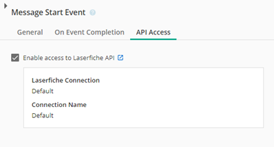
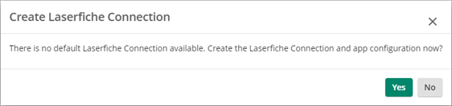

<!--© 2024 Laserfiche.
See LICENSE-DOCUMENTATION and LICENSE-CODE in the project root for license information.-->

# Using the Laserfiche API from Forms JS

Laserfiche Forms JS provides a way to interact with the Laserfiche API from within a form. This allows you to create custom forms that can interact with the Laserfiche repository, such as searching for documents, viewing or updating metadata, and more. Previous integrations with the rest of the Laserfiche Suite required submitting forms and having workflow handle the rest. Now you can build pseudo-applications that do not necessarily require submission. This is incredibly useful in situations where you included a "submit" button that does work and assigns the form back to the user. Now you should be able to include all of that business logic directly in the form itself so the user only needs to submit when they are done with the entire task, not any intermediary steps. For example, an AP invoice approval form may require indexing one or more documents manually as well as working outside of Laserfiche to complete the apporval. Now this approver can index the documents within the form in real time and submit when they are done with the entire task.

The Laserfiche API is automatically authenticated for you. This means that you can use the API to interact with the repository on behalf of the logged in user.

{: .note }
**Note:** Using the Laserfiche API from Forms JS is only available in Laserfiche Cloud and only for forms built with the new form designer.

## Enabling the Laserfiche API in Forms JS

In the process designer for the process you want to use the Laserfiche API in, click on any task step with a form (Message Start Event, or User Task) to open the task settings. You will see a new tab called "API Access". Click on this tab to enable the Laserfiche API in the form.



{: .note }
**Note:** You cannot use the API in public starting forms. If you have use cases that require this, please contact the [Laserfiche Product Team](mailto:product@laserfiche.com).

If this is the first time you are enabling the Laserfiche API in a project, you will need to accept the following modal to create the necessary resources in your Laserfiche Cloud account.



{: .note }
**Note:** You need to have access to the developer console to automate the creation of these resources. Once they are created any process developer can enable API Access. Only one connection is needed per project or global PA workspaces 


## Getting an Authenticated API Client

To retrieve an authenticated API client in Forms JS, use the following at the top of your code. It is important to call it as early as possible so subsequent code can determine if API access was enabled at this process step and handle any appropriate business logic. If you have code that changes the state/view of the form, you should call that before this code to not delay the user experience.

```javascript
const main = async () => {
  const apiClient = await LFForm.getLaserficheAPIClient('Default').catch(
    (err) => console.error(err)
  );
  const repositoryId = 'r-MY_REPO_ID_HERE';
  // Rest of the code
  // . . .
};
void main();
```
Following the "Rest of the code" comment, you should have an authenticated API client. You can now use any of the API methods described in the following resources.

Important notes:
1.	Handle all promises with await and catch. Read more about [promises here](https://developer.mozilla.org/en-US/docs/Learn/JavaScript/Asynchronous/Promises).
2.	Not all steps may have API Access enabled, so you can either:  
a.	Handle errors gracefully.  
b.	Use the new process information in the LFForm object to conditionally run your code. [LFForm Documenation](https://doc.laserfiche.com/laserfiche.documentation/en-us/Default.htm#../Subsystems/ProcessAutomation/Content/Forms-Current/Javascript-and-CSS/TheLFFormObject.htm#TheLFFormProperties)
3.	The API does have limits posted here, we are exploring expanding these limits so please reach out to [product@laserfiche.com](mailto:product@laserfiche.com) with your use cases and we can work to raise your limits!
