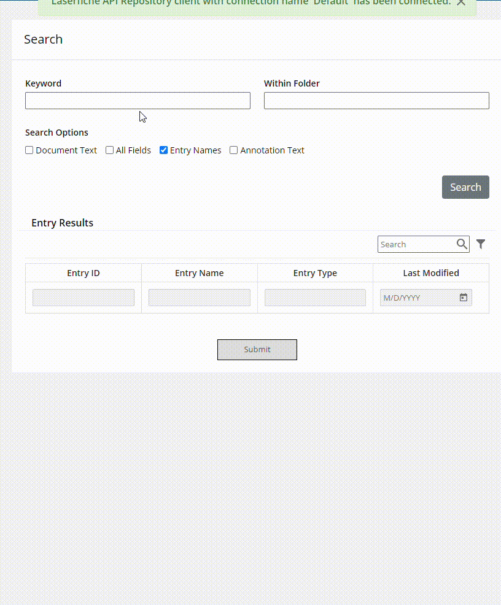
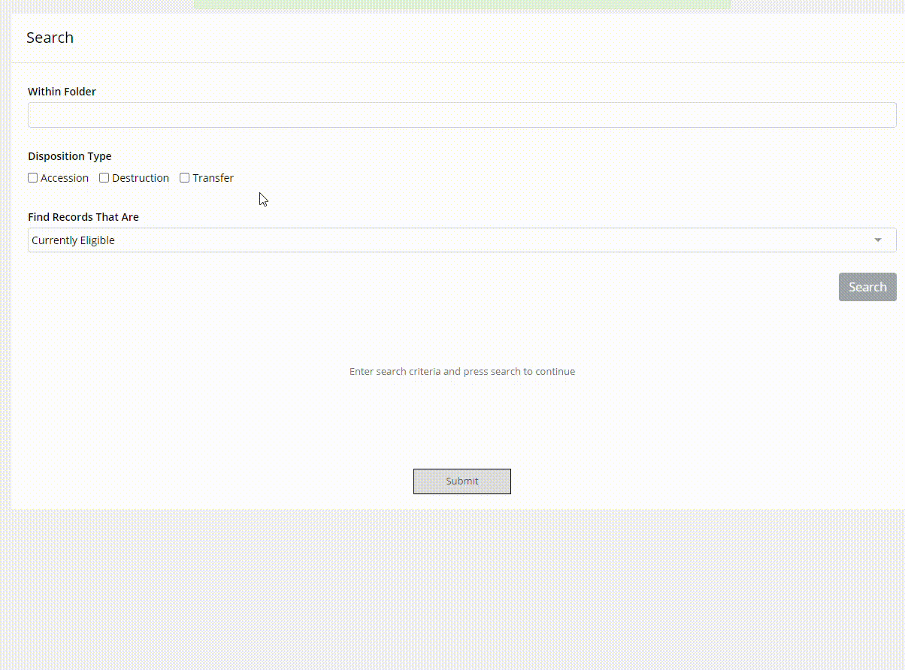

<!--© 2024 Laserfiche.
See LICENSE-DOCUMENTATION and LICENSE-CODE in the project root for license information.-->

# Using Repository Searches from Forms JS
Using searches directly in a form is a powerful way to display real-time results directly to the user without requiring an intermediary workflow or submission step. Searches can be used to display a list of entries that match a specific criteria, such as a list of invoices that need approval, or a list of documents that need to be checked for records management. This guide provides examples of how to use the Laserfiche API to search the repository from a form in Laserfiche Cloud.

Performing search operations in JS is beneficial over Web Request rules as you get more granular control over the syntax sent to the search query as well as only displaying search results the user can see in the repository. You also get the added benefit of flexibility and shareability of the code across multiple forms as shown below.

A starting template with the following use cases is available to [download here](./assets/API_Template_Searches.xml).

{: .note }
**Hint:** Click on the copy icon in the top right corner of the code block to copy the code to your clipboard.

## Use Cases
1. Basic Keyword Searches  
{: width="500px"}
2. Records Management Searches  
{: width="500px"}

## Running a Basic Search
```javascript
/**
 * The form fields used in this form.
 * @preserve
 */
const formFields = {
  withinFolder: { fieldId: 6 },
  dispositionType: { fieldId: 10 },
  recordRange: { fieldId: 11 },
  findFrom: { fieldId: 13 },
  findTo: { fieldId: 12 },
  searchButton: { fieldId: 9 },

  entryTable: { fieldId: 1 },
  entryId: { fieldId: 2 },
  entryName: { fieldId: 3 },
  entryType: { fieldId: 5 },
  entryLastModified: { fieldId: 4 },
};
const main = async () => {
  const apiClient = await LFForm.getLaserficheAPIClient<RepositoryApiClient>(
    'Default',
  );
  const repository = await getRepositories(apiClient);
  if (!repository || !repository.length || !repository[0].id) {
    return;
  }
  const repositoryId = repository[0].id;
  // register the search button click event
  window.handleSearchClick = async () => {
    try {
      const searchCommand = parseSearchCommand();
      const searchResults = await searchAsync(
        apiClient,
        repositoryId,
        searchCommand,
      );
      if (!searchResults) {
        return;
      }
      await fillTableWithSearchResults(formFields.entryTable, searchResults, {
        // For each column of the entry table, specify how to get the value from the search result
        [formFields.entryId.fieldId]: (entry) => entry.id,
        [formFields.entryName.fieldId]: (entry) => entry.name,
        [formFields.entryType.fieldId]: (entry) => entry.entryType,
        [formFields.entryLastModified.fieldId]: (entry) =>
          (entry.lastModifiedTime
            ? {
                dateStr: entry.lastModifiedTime.toLocaleDateString(),
              }
            : { dateStr: '' }),
      });
    } catch (e) {
      console.error(e)
    }
  };
  // enable the search button
  await LFForm.changeFieldSettings(formFields.searchButton, {
    content: `<button class="btn btn-secondary float-right" onclick="handleSearchClick()">Search</button>`,
  });
};
main().catch(console.error);
```
## Using more Advanced Search UI
```javascript
const main = async () => {
  const apiClientPromise =
    'getLaserficheAPIClient' in LFForm
      ? LFForm.getLaserficheAPIClient<RepositoryApiClient>('Default')
      : Promise.reject('Laserfiche API client not found');
  const apiClient = await apiClientPromise;
  const repository = await getRepositories(apiClient);
  if (!repository || !repository.length || !repository[0].id) {
    return;
  }
  const repositoryId = repository[0].id;
  window.handleSearchClick = async () => {
    try {
      await updateSearchButton({ state: 'disabled' });
      await updateSearchLoading(10);
      const searchCommand = buildAndValidateSearchSyntax();
      let lastPercent = 0;
      // On search start set the loading button to cancel the search operation
      const onSearchStart = (task?: StartTaskResponse) => {
        if (task?.taskId)
          void updateSearchButton({ state: 'cancel', params: [task.taskId] });
      };
      // On search poll update the loading bar with the progress
      const onSearchPoll = (task?: TaskProgress) => {
        if (
          task &&
          task.percentComplete &&
          task.percentComplete > lastPercent
        ) {
          lastPercent = task.percentComplete;
        }
        if (lastPercent < 10) {
          lastPercent = 10;
        }
        return updateSearchLoading(lastPercent);
      };
      const results = await searchAsync(
        apiClient,
        repositoryId,
        searchCommand,
        {
          maxPollAttempts: 20,
          pollInterval: 250,
          onPollIteration: onSearchPoll,
          onSearchStart,
        },
      );
      if (!results) {
        return;
      }
      await fillTableWithValues(results);
      await updateSearchButton({ state: 'enabled' });
      await updateSearchLoading(null);
    } catch (err) {
      await updateSearchLoading(null);
      const messageInError = err.message;
      const messageInProblem = err?.[0]?.title;
      const errorMessage =
        messageInError || messageInProblem || 'Invalid search';
      await updateSearchButton({
        state: 'enabled',
        errorMessage,
      });
    }
  };
};
void main();
```