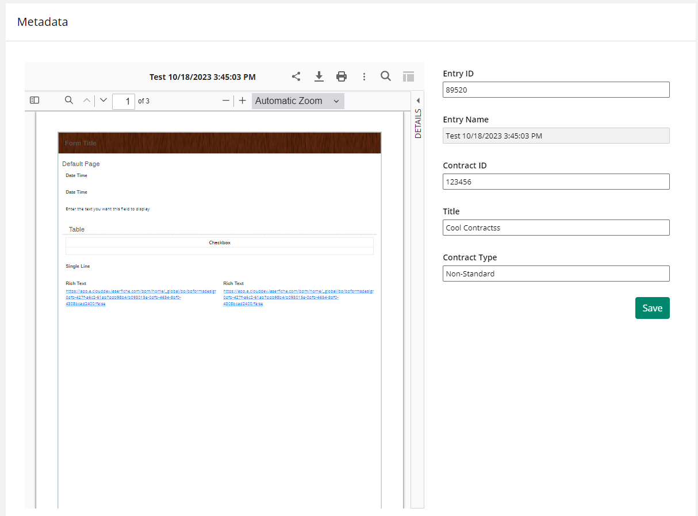
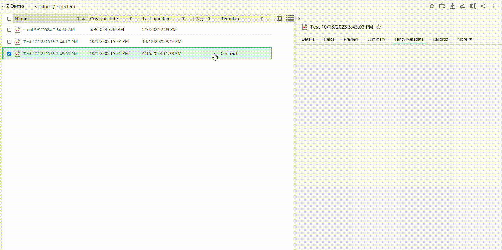

<!--© 2024 Laserfiche.
See LICENSE-DOCUMENTATION and LICENSE-CODE in the project root for license information.-->

# Using the Repository Metadata from Forms JS
Using an entry's metadata to prefill parts of your form is a great way to provide feedback to the form filler that they are working on the correct entry. This can be especially useful when you have a form that is used to update metadata on a folder or document. This guide provides examples of how to use the Laserfiche API to interact with the metadata of an entry in a Laserfiche repository.

Performing metadata operations in JS is beneficial over Web Request rules as you get more granular control over the fields returned from the API requests and the ability to easily chain these requests to perform more complex operations. You also get the added benefit of flexibility and shareability of the code across multiple forms as shown below.

A starting template with the following use cases is available to [download here](./assets/API_Template_Metadata.xml).

{: .note }
**Hint:** Click on the copy icon in the top right corner of the code block to copy the code to your clipboard.

## Table of Contents
1. [Automate the mapping of entry metadata to form fields](#automating-the-mapping-of-entry-metadata-to-form-fields)
{: width="500px"}
2. [Update the metadata of an entry](#updating-the-metadata-of-an-entry)
{: width="500px"}

## Automating the Mapping of Entry Metadata to Form Fields
The following code enables you to fill a form via an entry's metadata. Your form should have a field with a variable of "EntryID" and form fields that share the same label as the entry's metadata fields. This code is useful when you want to populate a form with metadata from an entry in the repository. The code maps the entry's metadata to the form fields based on the field's label or a custom field id. Optionally, you can disable fields after mapping.

The function `mapEntryToForm` takes the following options object:  

- `options` (*optional*): An object with the following properties:
  - `makeFieldsDisabled` (*optional*): A boolean or an array of field IDs to disable after mapping. Defaults to false.
  - `matchFieldBy` (*optional*): A string or an object that specifies how to match fields. If a string, it matches fields by label. If an object, it matches fields by the specified field ID.

**Example**  
```javascript
/// Code from snippet below goes above here /// 
const main = async () => {
  const apiClient = await LFForm.getLaserficheAPIClient('Default').catch(
    (err) => console.error(err)
  );
  const repositoryId = 'r-MY_REPO_ID_HERE';

  const mappedFields = await mapEntryToForm({
    repositoryId, // From variable above
    entryIdField: "123456", // Can be a field, a string, or a number
    apiClient, // From variable above
    options: { makeFieldsDisabled: [{ fieldId: 2 }] }
  });
  console.log(mappedFields);
};
void main();

```


<details markdown="1">
<summary>Full Code Example</summary>

</details>

## Update the metadata of an entry
The following code enables you to update the metadata of an entry in the repository. This code is useful when you want to update the metadata of an entry in the repository based on the form fields. The code updates the metadata of the entry based on the form fields' values. The helper function supports partial updates, meaning that only the fields that are present in the form will be updated even though this is not yet supported in the official API.

The function `updateEntryMetadata` takes the following options object:  

- `options`: An object with the following properties:
  - `newMetadata`: A list of the fields to include in the metadata update.

**Example**
```javascript
/// Code from snippet below goes above here /// 
const main = async () => {
  await LFForm.changeFieldSettings({ fieldId: formFields.saveButton }, {
    content: `<button class="btn btn-primary float-right" onclick="window.onSaveClick()">Save</button>`,
  });
  const apiClient = await LFForm.getLaserficheAPIClient('Default');
  const repositories = await getRepositories(apiClient);
  const repository = repositories[0];
  const entryIdField = LFForm.findFieldsByVariableName(formFields.entryId)[0];
  window.onSaveClick = async () => {
    await patchEntryMetadata({
      repositoryId: repository.id,
      entryIdField,
      apiClient,
      options: {
        newMetadata: LFForm.findFieldsByClassName('new-metadata'),
      },
    });
  };
};
void main();
```

<details markdown="1">
<summary>Full Code Example</summary>

</details>