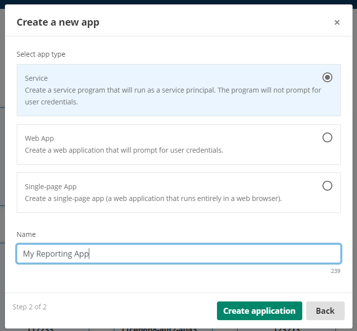
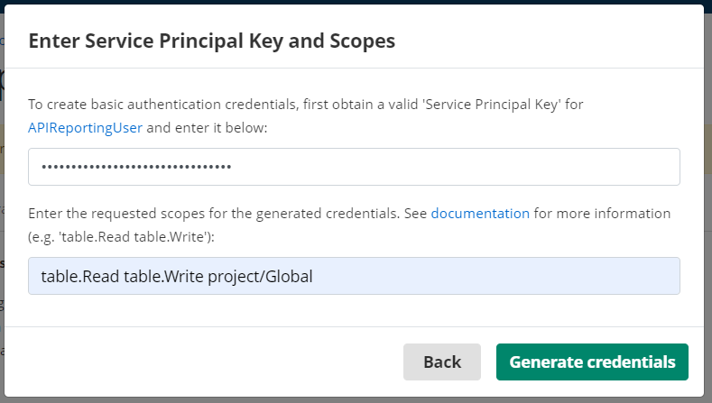
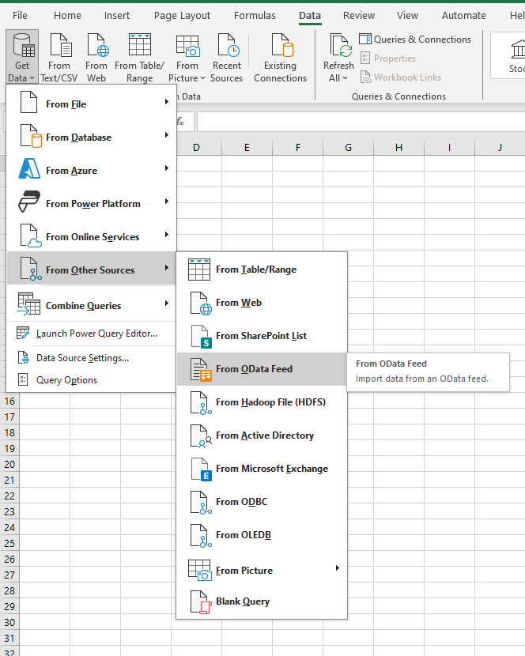
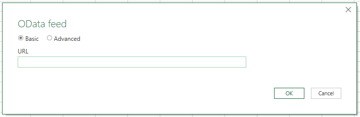
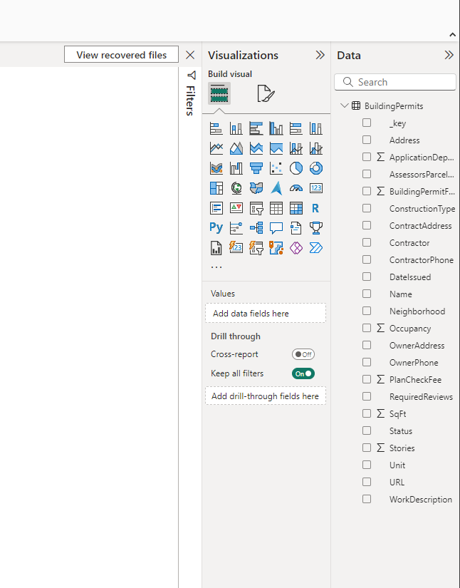

<!--© 2024 Laserfiche.
See LICENSE-DOCUMENTATION and LICENSE-CODE in the project root for license information.-->

# Accessing Lookup Tables from Reporting Applications

The Laserfiche Lookup Table API supports the OData 4 standard, which enables it to be used with popular reporting applications like PowerBI, Tableau, and Excel.  This guide will walk you through how to connect to your Lookup Tables from these tools, but these instructions should generally apply to most reporting tools that support connecting to data via the OData standard. If this is your first time working with the Lookup Table API, it is recommended that you review the [table API overview](./../../api/odata-api-reference/) first.

## 1. Configure a Lookup Table
Lookup Tables are configured in `Process Automation -> Data Management -> Lookup Tables` and belong to either `Global` or a specific Process Automation Project which defines the security scope. You can read more about Projects in Process Automation [here](https://doc.laserfiche.com/laserfiche.documentation/en-us/Default.htm#../Subsystems/ProcessAutomation/Content/Resources/Teams/projects.htm?TocPath=Process%2520Automation%257CTeams%257CProjects%257C_____0).

{: .note }
**Note:** The security scopes e.g. `project\Global` or `project\YourProjectName` and `table.Read` must be configured in the Service Application and included in the credentials.

## 2. Create your App in the Laserfiche Developer Console
- You'll need to select an existing Service Principal account, or create a new one, and then generate a Service Principal Key (record the key string, you'll need it later). Review our [dedicated guide](./../../api/authentication/guide_service-principals/) on this topic for more details.
- -  Create a Service Application to represent the integration with your reporting tools. Follow instructions [here](./../../api/authentication/guide_oauth-service/) on creating a Service App in the Laserfiche Developer Console.  It is important to follow the instructions for the Username/Password authentication method, as that is the only authentication method that is supported by  most reporting tools like PowerBI, Excel, or Tableau.

{: .note }
**Note:** Service Principal account must have Process Automation Administrator role.

{: width ="200"}

{: width ="200"}

{: width ="200"}

## 3. Create an OData Connection to the Laserfiche API
At this point, you should be ready to set up your reporting tool of choice to access your Lookup Table data. In the steps below we will configure Excel and PowerBI, but the steps should be very similar for most other OData compliant applications.

### Excel (Microsoft Office 365)
	
1. From the "Data" tab in the Office Ribbon, select the "Get Data" button, then "From Other Sources…", then "From OData Feed".
   
   {: width ="200"}
   
2. In the Odata Feed window, enter the appropriate URL (see below) for your Laserfiche Cloud environment and click "OK".
	- US Cloud Customers: https://api.laserfiche.com/odata4/table/
	- CA Cloud Customers: https://api.laserfiche.ca/odata4/table/
	- EU Cloud Customers: https://api.eu.laserfiche.com/odata4/table/
   {: width ="200"}
3. In the next window, select "Basic" from the side navigation options, then enter the Username and Password you created in the Developer Console previously. In the "Select which level to apply these settings to" drop down, you can select the URL that most closely matches the URLs in step 2 above.
   
   {: width ="200"}
   
4. In the Navigator window you should now see all the Lookup Tables that your app has access to view. You can now select a table and click the "Load" button. In our example, we will select the "BuildingPermits" table.
   
   {: width ="200"}
   
5. The Lookup Table rows should now be loaded into a new sheet in your Excel file. You can work with the data within Excel to build reports and analyze. 
	
### PowerBI Desktop
	
1. In PowerBI Desktop, select "Get data" from the "Home" tab in the Office Ribbon, then select the "OData Feed" option.

	{: width ="200"}

2. In the Odata Feed window, enter the appropriate URL (see below) for your Laserfiche Cloud environment and click "OK".
	- US Cloud Customers: https://api.laserfiche.com/odata4/table/
	- CA Cloud Customers: https://api.laserfiche.ca/odata4/table/
	- EU Cloud Customers: https://api.eu.laserfiche.com/odata4/table/

	{: width ="200"}
	
3. In the next window,  select "Basic" from the side navigation options, then enter the Username and Password you created in the Developer Console previously. In the "Select which level to apply these settings to" drop down, you can select the URL that most closely matches the URLs in step 2 above.

	{: width ="200"}
   
4. In the Navigator window you should now see all the Lookup Tables that your app has access to view.  You can now select a table and click the "Load" button.  In our example, we will select the "BuildingPermits" table.

 	{: width ="200"}
 
5. You should now see the schema for your Lookup Table in the Data pane.  You can now select individual columns from your table to drag onto the PowerBI canvas and build your visualizations and reports.

 	{: width ="200"}

### Tableau
	
1. From the Tableau "Connect" screen, under the "To a Server" heading, select "More...", then "OData".

	{: width ="200"}

2. In the Odata window, enter the appropriate URL (see below) for your Laserfiche Cloud environment.  Then select the "Basic" authentication option and enter the Username and Password you created in the Developer Console.
	- US Cloud Customers: https://api.laserfiche.com/odata4/table/
	- CA Cloud Customers: https://api.laserfiche.ca/odata4/table/
	- EU Cloud Customers: https://api.eu.laserfiche.com/odata4/table/

 	{: width ="200"}

3. You should now see the schema for your Lookup Table in the main Tableau canvas.  You can now select individual columns from your table to drag onto the canvas and build your visualizations and reports.

 	{: width ="200"}
